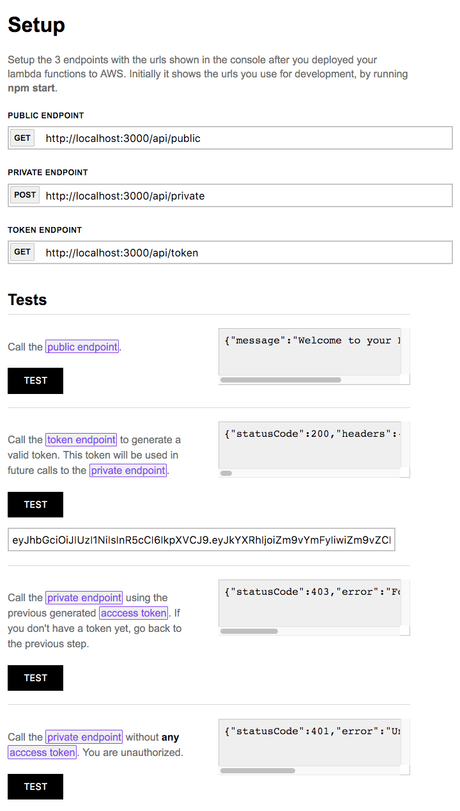

## Start

### Config

Update your `~/.aws/credentials` with your AWS credentials:

```
[CHOOSE_A_PROFILE_NAME]
aws_access_key_id = CHANGE_IT_HERE
aws_secret_access_key = CHANGE_IT_HERE
```


Create a file called `api/serverless.env.yml` on the root of this project with the following content:

```
default_env: &default_env
  SERVICE: 'myservice'
  REGION: 'us-west-2' # CHANGE YOUR REGION
  STAGE: 'dev'

dev:
  <<: *default_env
  PROFILE: 'CHANGE_IT_HERE'
  ACCOUNT_ID: 'CHANGE_IT_HERE'
  ACCOUNT_CANONICAL_ID: 'CHANGE_IT_HERE'
  STAGE: 'dev'
```

### Develop Lambda Functions

In your project root run:

`npm start` or `serverless offline start` or `sls offline start`

to list all the options for the plugin run:

`sls offline --help`


### Deploy Lambda Functions & API Gateway

`npm run deploy`


### Remove Lambda Functions & API Gateway

`npm run remove`


### Deploy UI

`cd app && surge` or `cd app && npm run publish`

Your frontend application will be hosted on surge.sh

**You must change the  content in the file app/CNAME**

---
## APP PREVIEW





## Read it later
https://www.npmjs.com/package/serverless-domain-manager
